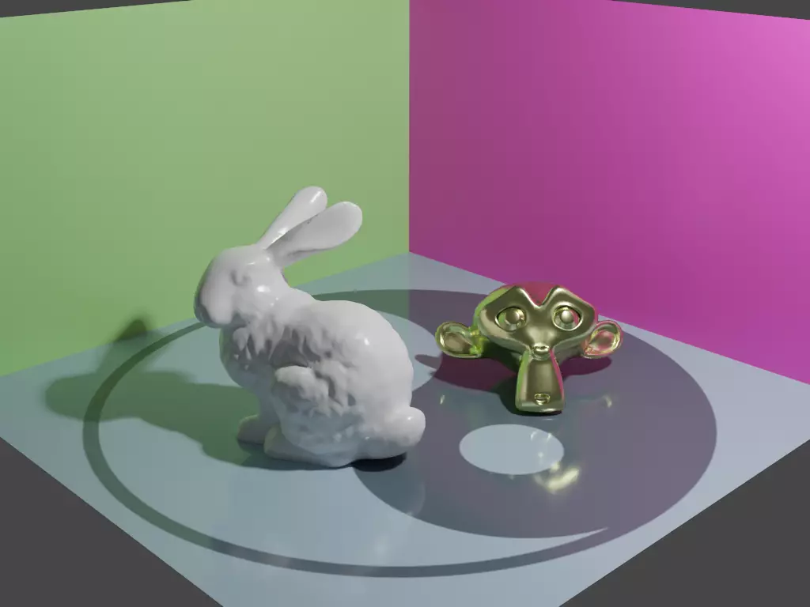

### Hi there 👋 This is 彭于斌!

I make elegantly robust **💻 computer graphics and 🐧 operating system** wheels for fun. 🌈

- 🔭 I’m currently working on ZENO, a node system framework for simulation.
- 🌱 I’m currently learning C++17 programming skills from @littlemine.
- 👯 I’m looking to collaborate on physics simulation developers.
- 🤔 I’m looking for help with who can beautify my node editor.
- 🎓 I'm a college student major in software engineering :)
- 💬 Ask me about computer graphics and operating system.
- 📫 How to reach me: 1931127624@qq.com or archibate@foxmail.com.
- 😄 Pronouns: he, she, you, me, I, we, us, this, them, that.
- ⚡ Fun fact: I'm a remote employee from Shanghai to Shenzhen :)
- 🕵 Take a look at my repositories and let's get in touch!
- 🎵 By the way, I love music, so I'm a big fan of HarumakiGohan!

[GitHub @ archibate](https://github.com/archibate) | [Bilibili @ 双笙子佯谬](https://space.bilibili.com/263032155/) | [Twitter @ archibate](https://twitter.com/archibate) | [Gitee @ archibate](https://gitee.com/archibate) | [Steam @ archibate](https://steamcommunity.com/id/archibate) | [Zhihu @ 幼儿园理化笙](https://www.zhihu.com/people/di-san-miao-mo-de-shuang-qu-zheng-qie-43) | [WeChat @ tanh233](/)
